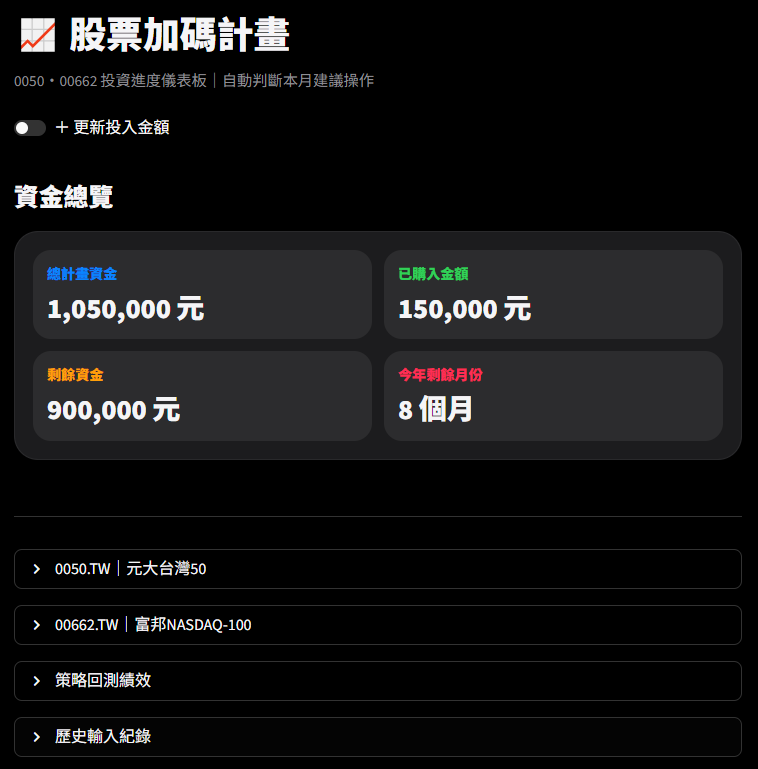
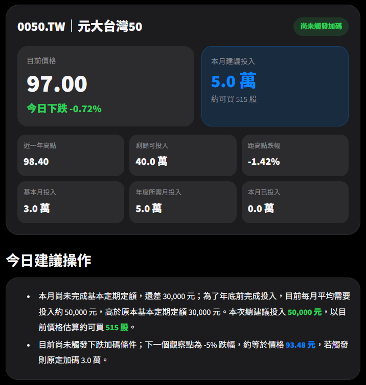
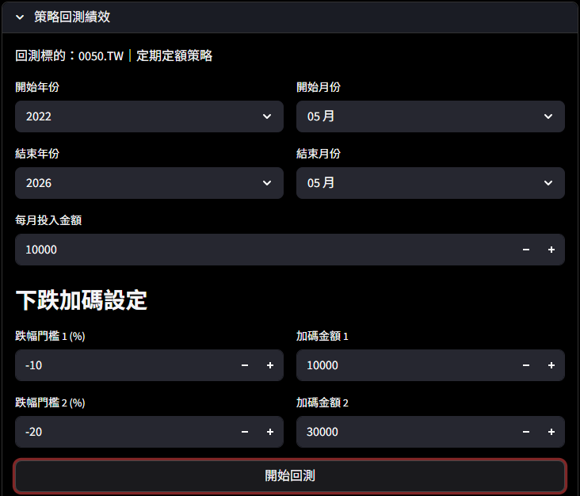
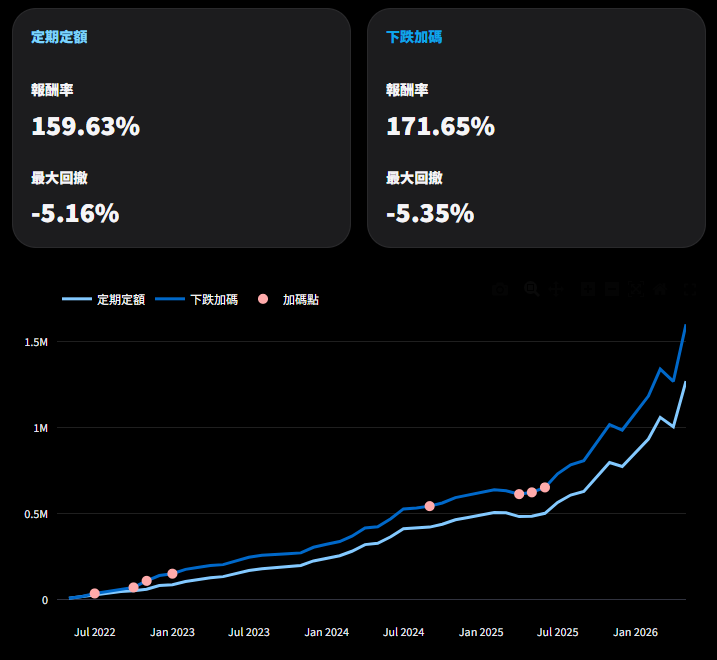
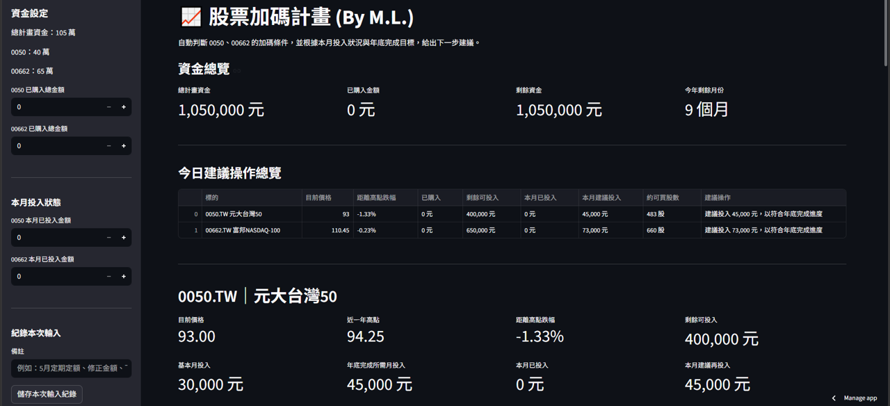

# 股票加碼計畫｜低頻投資決策儀表板

以「低頻投資、紀律加碼」為核心設計的投資決策系統。  
透過 ETF 即時追蹤、下跌加碼策略、定期定額與策略回測，
協助使用者建立更有紀律的長期投資流程。

---

## Demo

🔗 Streamlit Cloud：  
https://your-demo-link.streamlit.app/

---

## Tech Stack

- Python
- Streamlit
- yfinance
- Plotly
- pandas
- Google Sheets API
- gspread
- Streamlit Cloud
- session_state

---

# 主畫面



---

# 標的今日建議操作



---

# 數據回測



---

# 定期定額/下跌加碼策略比較



---

<details>
<summary><b>功能特色</b></summary>

<br>

## 即時 ETF 追蹤

- 支援 0050 / 00662 即時資料更新
- 顯示一年高點與目前跌幅
- 自動計算剩餘投入資金

---

## 今日建議操作

- 自動判斷本月建議投入金額
- 提供下跌加碼提醒
- 顯示下一個加碼觸發點

---

## 定期定額策略

- 依年度預算自動分配投入
- 計算年底追趕進度
- 支援不同 ETF 資金配置

---

## 策略回測系統

- 自訂回測區間
- 模擬定期定額策略
- 模擬下跌加碼策略

---

## 雙策略比較

- 報酬率比較
- 最大回撤分析
- 資產曲線比較

---

## Google Sheets 紀錄同步

- 自動保存輸入紀錄
- 雲端同步管理
- 支援歷史查詢

---

## 手機版 UI

- 響應式設計
- 行動裝置優化
- iOS Health 風格介面

</details>

---

<details>
<summary><b>技術架構</b></summary>

<br>

```text
使用者輸入
   ↓
Streamlit UI
   ↓
session_state 狀態管理
   ↓
策略計算模組
   ↓
yfinance 即時資料
   ↓
Plotly 視覺化
   ↓
Google Sheets API
```
</details>

---

<details>
<summary><b>開發過程</b></summary>

<br>

## 專案起點

這個專案最初的想法，
來自於自己在投資過程中的一個問題：

「明明知道應該長期投資，卻還是容易因為市場波動而猶豫。」

在實際投入 ETF 的過程中，
經常會遇到：

- 不知道現在是否該加碼
- 害怕一買就下跌
- 市場大跌時不敢投入
- 太常看盤造成情緒波動

因此開始思考：

是否能把「投資紀律」系統化？

這個專案便是以此為核心，
嘗試將：

- 定期定額
- 分批加碼
- 跌幅判斷
- 資金配置
- 回測分析

整合成一個低頻投資決策儀表板。

希望透過更視覺化、更直觀的方式，
降低情緒化操作，
並建立長期、可持續的投資流程。

---

## UI 設計
最初版本


在開發初期，
介面主要以功能實作為主，
但隨著功能逐漸增加，
開始思考：

「如何讓投資資訊更容易閱讀？」

因此後續逐步將 UI 重新設計為：

- 深色主題
- 卡片式資訊區塊
- 手機版響應式介面
- iOS 風格視覺設計

希望降低長時間閱讀數據時的視覺負擔。

在版面設計上，
也特別針對：

- 手機瀏覽
- 區塊資訊層級
- 投資建議可讀性
- 展開式資訊區塊

進行調整。

最終希望讓整個系統不只是「能用」，
而是更接近真正投資工具的操作體驗。

---

## Streamlit 狀態管理

由於專案包含：

- 多個輸入區塊
- 即時策略計算
- 回測參數設定
- 展開式介面
- Google Sheets 紀錄同步

因此在開發過程中，
需要大量處理 Streamlit 的狀態管理問題。

專案中主要透過 `session_state` 管理：

- 使用者輸入資料
- ETF 投入金額
- 回測參數
- 頁面互動狀態
- 表單同步更新

避免因 Streamlit 重新 rerun 而導致資料遺失或畫面異常。

在 UI 功能逐漸增加後，
也開始針對：

- 區塊間資料同步
- Expander 展開狀態
- 動態更新流程
- 多區域互動邏輯

進行調整與優化。

這部分也是專案開發過程中，
花費最多時間處理的核心問題之一。

---

## 策略邏輯

（待補充）

---

## Google Sheets 整合

（待補充）

</details>
